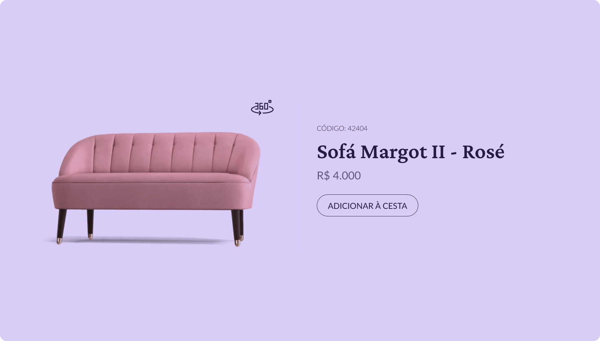

<h1 align='center'>Sofá Margot II - #boraCodar</h1>

 Esse projeto foi desenvolvido durante o segundo desafio semanal da Rocketseat, chamado #boraCodar. O projeto foi desenvolvido em <b>HTML5, CSS3 e JavaScript.</b>

- [Acessar Desafio](https://boracodar.dev)

## 🚀 Tecnologias

- HTML5, CSS3.
- JavaScript.
- Flexbox.

<h3>🖌️ Protótipo</h3>

Acesse o protótipo disponibilizado pela Rocketseat clicando no botão abaixo:

<h3>👓 Deploy</h3>

Acesse o projeto em produção clicando no botão abaixo:

## 🏷️ Autor

<table>
  <tr>
    <td align="center"><a href="https://github.com/gabrielgxrcia"> <b>Gabriel Garcia</b></a>  ⠀
